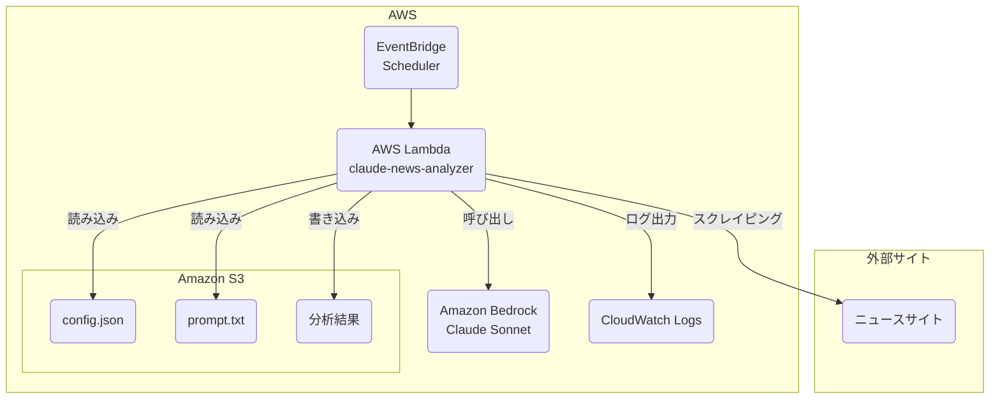

# Bedrock Claude 自動ニュース分析Lambda

AWS Lambda上で動作し、毎日日本の主要技術メディアから記事を収集・分析し、Amazon Bedrock上のClaudeモデルでレポートを生成するシステムです。

## アーキテクチャ

このシステムは、以下のAWSサービスを連携させたサーバーレスアーキテクチャで構築されています。



1.  **Amazon EventBridge**: 毎日定刻（例: JST 9:00）にLambda関数をトリガーします。
2.  **AWS Lambda**: メインの処理を実行するPythonアプリケーション。
    -   S3から設定ファイルとプロンプトテンプレートを読み込みます。
    -   `news_scraper.py` を使用して、複数の技術ニュースサイトから記事をスクレイピングします。
    -   `bedrock_client.py` を介して、収集した記事データをBedrock上のClaudeモデルに送信し、分析レポートを要求します。
    -   生成されたレポートと収集した記事一覧をS3バケットに保存します。
3.  **Amazon S3**: 設定、プロンプト、および出力結果を永続化します。
4.  **Amazon Bedrock**: Claude Sonnetなどの高性能なLLMを提供し、高度なテキスト分析を実行します。
5.  **Amazon CloudWatch Logs**: Lambda関数の実行ログを収集・保存し、監視とデバッグを容易にします。

## 主な機能

-   **サーバーレス**: AWS Lambdaで実行され、サーバーのプロビジョニングや管理が不要です。
-   **自動実行**: Amazon EventBridgeにより、スケジュールベースで完全に自動化されています。
-   **ニュース収集**: 6つの主要技術メディア（@IT, ITmediaなど）からRSS経由で記事を自動収集します。
-   **高精度な本文抽出**: `trafilatura`ライブラリとサイト固有のセレクタを組み合わせた3段階のフォールバック戦略により、広告などを除外した本文を高精度で抽出します。
-   **AI分析**: Amazon Bedrockを介してClaudeモデルを利用し、トレンド分析、注目ニュースの深掘り、技術分類などを実行します。
-   **設定の外部化**: `config.json`と`news_analysis_prompt.txt`をS3で管理するため、コードを再デプロイすることなく設定やプロンプトを変更できます。
-   **簡単なデプロイ**: シェルスクリプト (`deploy/deploy.sh`) により、Lambda Layerと関数コードを一度にデプロイできます。

## 使用技術

-   **クラウド**: AWS Lambda, Amazon S3, Amazon Bedrock, Amazon CloudWatch, Amazon EventBridge
-   **言語**: Python 3.11
-   **主要ライブラリ**: `boto3`, `requests`, `feedparser`, `trafilatura`, `beautifulsoup4`, `chardet`

## ディレクトリ構造

```
autoLLMGetter/
├── lambda_handler.py       # Lambda関数のエントリーポイント
├── llm_fetcher.py          # Bedrock呼び出しと全体フロー制御
├── bedrock_client.py       # Amazon Bedrock APIクライアント
├── news_scraper.py         # ニュース収集・記事本文取得モジュール
├── s3_handler.py           # S3操作ヘルパー
├── cloudwatch_logger.py    # CloudWatch Logs用ロガー
├── config/
│   ├── config.json         # 設定ファイル（S3に配置）
│   └── news_analysis_prompt.txt # プロンプトテンプレート（S3に配置）
├── deploy/
│   ├── deploy.sh           # デプロイスクリプト
│   ├── build_layer.sh      # Lambda Layer構築スクリプト
│   └── policies/           # IAMポリシーサンプル
├── requirements.txt        # ローカルテスト用依存関係
├── requirements-lambda.txt # Lambda Layer用依存関係
└── README.md               # このファイル
```

## デプロイ手順

### 1. 前提条件

-   [AWS CLI](https://aws.amazon.com/cli/)がインストールされ、認証情報が設定済みであること。
-   デプロイ先のAWSリージョンとS3バケット名、IAMロールのARNを決定しておくこと。

### 2. IAMロールの作成

Lambda関数に以下の権限を持つIAMロールが必要です。

-   **信頼関係**: `lambda.amazonaws.com`
-   **権限ポリシー**: 
    -   `AWSLambdaBasicExecutionRole` (CloudWatch Logsへの書き込み)
    -   `AmazonS3FullAccess` (または特定のバケットへの `s3:GetObject`, `s3:PutObject`)
    -   `BedrockFullAccess` (または特定のモデルに対する `bedrock:InvokeModel`)

サンプルポリシーは `deploy/policies/permissions-policy.json` を参照してください。

### 3. 設定ファイルの準備とアップロード

1.  S3バケットを作成します。
    ```bash
    aws s3 mb s3://<your-bucket-name> --region <your-region>
    ```
2.  `config/config.json` と各プロンプトファイルを編集します。
3.  編集したファイルをS3バケットの `config/` プレフィックスにアップロードします。
    ```bash
    aws s3 cp config/config.json s3://<your-bucket-name>/config/config.json
    aws s3 cp config/news_analysis_prompt.txt s3://<your-bucket-name>/config/news_analysis_prompt.txt
    aws s3 cp config/weekly_news_analysis_prompt.txt s3://<your-bucket-name>/config/weekly_news_analysis_prompt.txt
    aws s3 cp config/monthly_news_analysis_prompt.txt s3://<your-bucket-name>/config/monthly_news_analysis_prompt.txt
    ```

### 4. デプロイスクリプトの実行

1.  `deploy/deploy.sh` を開き、環境に合わせて変数を設定するか、環境変数としてエクスポートします。
    ```bash
    export LAMBDA_ROLE_ARN="arn:aws:iam::123456789012:role/your-lambda-role"
    export S3_BUCKET_NAME="your-bucket-name"
    export AWS_REGION="ap-northeast-1"
    ```
2.  デプロイスクリプトを実行します。
    ```bash
    ./deploy/deploy.sh
    ```
    これにより、`requirements-lambda.txt` に基づくLambda Layerが構築・公開され、関数コードがパッケージ化されてデプロイされます。
    既存の Lambda 関数がある場合は削除せず、コードと設定が更新されます。

### 5. 定期実行の設定 (EventBridge)

デプロイ成功後、表示されるAWS CLIコマンドを参考にEventBridgeルールを作成し、Lambda関数をターゲットとして設定します。

1.  **ルールを作成** (毎日 00:00 UTC / 09:00 JST に日次分析を実行):
    ```bash
    aws events put-rule \
      --name claude-news-analyzer-daily \
      --schedule-expression 'cron(0 0 * * ? *)' \
      --region ${AWS_REGION}
    ```
2.  **ターゲットを設定**:
    ```bash
# YOUR_ACCOUNT_IDとFUNCTION_NAMEを実際の値に置き換えてください
FUNCTION_ARN="arn:aws:lambda:${AWS_REGION}:YOUR_ACCOUNT_ID:function:claude-news-analyzer"

cat > /tmp/claude-news-analyzer-daily-target.json <<EOF
[
  {
    "Id": "1",
    "Arn": "${FUNCTION_ARN}",
    "Input": "{\"analysis_type\":\"daily\"}"
  }
]
EOF

aws events put-targets \
  --rule claude-news-analyzer-daily \
  --targets file:///tmp/claude-news-analyzer-daily-target.json \
  --region ${AWS_REGION}
    ```
    週次・月次は同じLambdaに別ルールで `analysis_type` を渡します。
    ```bash
aws events put-rule \
  --name claude-news-analyzer-weekly \
  --schedule-expression 'cron(0 1 ? * SUN *)' \
  --region ${AWS_REGION}

cat > /tmp/claude-news-analyzer-weekly-target.json <<EOF
[
  {
    "Id": "1",
    "Arn": "${FUNCTION_ARN}",
    "Input": "{\"analysis_type\":\"weekly\"}"
  }
]
EOF

aws events put-targets \
  --rule claude-news-analyzer-weekly \
  --targets file:///tmp/claude-news-analyzer-weekly-target.json \
  --region ${AWS_REGION}

aws events put-rule \
  --name claude-news-analyzer-monthly \
  --schedule-expression 'cron(0 2 1 * ? *)' \
  --region ${AWS_REGION}

cat > /tmp/claude-news-analyzer-monthly-target.json <<EOF
[
  {
    "Id": "1",
    "Arn": "${FUNCTION_ARN}",
    "Input": "{\"analysis_type\":\"monthly\"}"
  }
]
EOF

aws events put-targets \
  --rule claude-news-analyzer-monthly \
  --targets file:///tmp/claude-news-analyzer-monthly-target.json \
  --region ${AWS_REGION}
    ```
3.  **Lambdaにトリガー権限を追加**:
    ```bash
    aws lambda add-permission \
      --function-name claude-news-analyzer \
      --statement-id EventBridgeInvoke \
      --action "lambda:InvokeFunction" \
      --principal events.amazonaws.com \
      --source-arn arn:aws:events:${AWS_REGION}:YOUR_ACCOUNT_ID:rule/claude-news-analyzer-daily \
      --region ${AWS_REGION}
    ```

## ローカルでのテスト

`lambda_handler.py` には、ローカル環境でLambda関数の動作をシミュレートするためのテスト関数が含まれています。

1.  **依存関係のインストール**:
    ```bash
    pip install -r requirements.txt
    ```
2.  **AWS認証情報の設定**: ローカル環境でAWSの認証情報（例: `~/.aws/credentials`）が設定されていることを確認してください。
3.  **環境変数の設定**:
    ```bash
    export S3_BUCKET_NAME="your-s3-bucket-name"
    ```
4.  **テストの実行**:
    ```bash
    python lambda_handler.py
    ```
    これにより、`local_test()` 関数が実行され、実際の `lambda_handler` がモックイベントで呼び出されます。処理結果はコンソールに出力されます。

## 設定ファイル (`config.json`)

S3に配置する `config.json` でシステムの挙動を制御します。

```json
{
  "llm_provider": "bedrock",
  "bedrock_model": "anthropic.claude-3-sonnet-20240229-v1:0", // 使用するBedrockモデルID
  "bedrock_region": "us-east-1", // Bedrockが利用可能なリージョン
  "bedrock_max_tokens": 4096,
  "max_retries": 3,
  "retry_delay": 5,
  "news_scraping": {
    "enabled": true,
    "scrape_yesterday_articles": true, // true:前日, false:当日
    "timezone": "Asia/Tokyo",
    "parallel_workers": 3, // RSS取得の並列数
    "max_articles_per_site": 30,
    "content_fetching": {
      "enabled": true, // 本文取得を有効化
      "parallel_content_workers": 5, // 本文取得の並列数
      "min_content_length": 200
    },
    "sites": [
      // 収集対象サイトのリスト
    ]
  }
}
```
