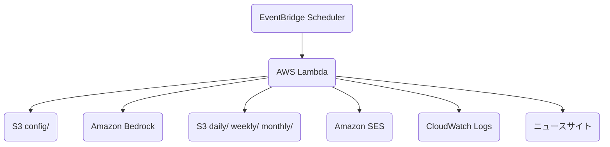

# Bedrock Claude 自動ニュース分析 Lambda

AWS Lambda 上で日本の技術ニュースを収集し、Amazon Bedrock の Claude モデルで分析して、結果を S3 に保存するサーバーレスアプリケーションです。日次・週次・月次の分析に対応し、必要に応じて Amazon SES で分析結果への期限付き S3 URL を通知します。

## アーキテクチャ



1. EventBridge が `analysis_type` を渡して Lambda を定期実行します。
2. Lambda が S3 の設定ファイルとプロンプトを読み込みます。
3. 日次分析では RSS と記事本文を取得し、Bedrock で分析します。
4. 週次・月次分析では S3 の前段レポートを読み込み、Bedrock で集約します。
5. 分析結果と記事一覧を S3 に保存し、設定が有効な場合は SES で presigned URL を通知します。

## 主な機能

- 日次・週次・月次のニュース分析
- RSS と本文抽出による技術ニュース収集
- Amazon Bedrock Claude モデルによる分析レポート生成
- 分析結果のテキスト保存と公開用 HTML 保存
- S3 配置の `config.json` とプロンプトによる設定外部化
- Amazon SES によるメール通知
- Secrets Manager に保存した署名用 IAM ユーザーでの長期 presigned URL 生成
- EventBridge によるスケジュール実行

## 使用技術

- AWS Lambda, Amazon S3, Amazon Bedrock, Amazon SES, Amazon EventBridge, CloudWatch Logs, Secrets Manager
- Python 3.11
- `boto3`, `requests`, `feedparser`, `trafilatura`, `beautifulsoup4`, `chardet`

## ディレクトリ構成

```text
bedrock-news-analyzer/
├── lambda_handler.py       # Lambda エントリーポイント
├── llm_fetcher.py          # 全体フロー制御
├── bedrock_client.py       # Amazon Bedrock クライアント
├── news_scraper.py         # RSS 取得・本文抽出
├── report_html_renderer.py # 分析結果HTML変換
├── s3_handler.py           # S3 操作
├── email_notifier.py       # SES メール通知
├── cloudwatch_logger.py    # ロガー
├── config/
│   ├── config.json
│   ├── news_analysis_prompt.txt
│   ├── weekly_news_analysis_prompt.txt
│   └── monthly_news_analysis_prompt.txt
├── deploy/
│   ├── deploy.sh
│   ├── build_layer.sh
│   └── policies/
├── LAMBDA_DEPLOYMENT.md    # AWS デプロイ・運用手順
├── requirements.txt
└── requirements-lambda.txt
```

## 最短セットアップ

詳細な初回構築、IAM、Secrets Manager、SES、EventBridge、ロールバック、トラブルシューティングは [LAMBDA_DEPLOYMENT.md](./LAMBDA_DEPLOYMENT.md) を参照してください。

### 1. ローカル環境

```bash
python3.11 -m venv .venv
source .venv/bin/activate
pip install -r requirements.txt
```

### 2. S3 設定ファイル

`config/config.json` と 3 種類のプロンプトを編集し、S3 の `config/` 配下へアップロードします。

```bash
aws s3 cp config/config.json s3://<your-bucket-name>/config/config.json
aws s3 cp config/news_analysis_prompt.txt s3://<your-bucket-name>/config/news_analysis_prompt.txt
aws s3 cp config/weekly_news_analysis_prompt.txt s3://<your-bucket-name>/config/weekly_news_analysis_prompt.txt
aws s3 cp config/monthly_news_analysis_prompt.txt s3://<your-bucket-name>/config/monthly_news_analysis_prompt.txt
```

### 3. 初回デプロイ・再デプロイ

Lambda 実行ロールと周辺 AWS リソースを準備したうえで、同じスクリプトを初回構築と再デプロイに使います。

```bash
export LAMBDA_ROLE_ARN="arn:aws:iam::ACCOUNT_ID:role/lambda-claude-news-analyzer"
export S3_BUCKET_NAME="claude-news-analyzer"
export AWS_REGION="ap-northeast-1"
./deploy/deploy.sh
```

Lambda 実行ロールの権限例は `deploy/policies/permissions-policy.json` を正本とします。メール通知で Secrets Manager の署名用 IAM ユーザーを使う場合は、同ポリシーの `secretsmanager:GetSecretValue` も反映してください。

### 4. ローカル実行

AWS 認証情報と S3 バケットを設定したうえで、モックイベントで Lambda 処理を実行できます。

```bash
export S3_BUCKET_NAME="your-s3-bucket-name"
python lambda_handler.py
```

## 設定ファイル

S3 に配置する `config/config.json` でモデル、プロンプト、出力先、スクレイピング、メール通知を制御します。

主要項目:

- `bedrock_model`: 使用する Bedrock モデル ID
- `bedrock_region`: Bedrock 呼び出しリージョン
- `prompt_paths`: `daily`, `weekly`, `monthly` ごとのプロンプトパス
- `output_prefixes`: 分析結果の S3 プレフィックス
- `news_scraping`: RSS と本文取得の対象・並列数・本文長など
- `email_notification`: SES 通知と presigned URL 署名方式

## 出力ファイル

分析結果はMarkdown本文の `.md` と、閲覧用の `.html` を同じプレフィックスに保存します。週次・月次分析の入力には `.md` を優先して使い、移行期間の互換用として過去の `.txt` も参照します。メール通知の「分析結果」リンクは `.html` を指します。日次の収集記事一覧は `daily/YYYY-MM-DD_articles.txt` のままです。

### メール通知

`email_notification.enabled` を `true` にすると、分析完了後に S3 オブジェクトへの presigned URL を SES で送信します。主な項目は次のとおりです。

- `enabled_analysis_types`: 通知対象の分析種別。例: `["daily", "weekly", "monthly"]`
- `sender`: SES で検証済みの送信元アドレス
- `recipients`: 通知先アドレス
- `presigned_url_expires_seconds`: URL 有効期限。Signature Version 4 の上限に合わせ 604800 秒以下
- `presigned_url_signer_type`: `iam_user_secret` を指定すると Secrets Manager の IAM ユーザーキーで署名
- `presigned_url_signing_secret_id`: 署名用 IAM ユーザーキーを保存した Secret 名または ARN
- `presigned_url_signing_secret_region`: Secret を取得するリージョン
- `presigned_url_s3_region`: presigned URL を生成する S3 クライアントのリージョン
- `fail_on_send_error`: メール送信失敗時に Lambda を失敗扱いにするか

署名用 IAM ユーザー、Secrets Manager、SES sandbox、`aws_session_token` を含めない確認などの運用手順は [LAMBDA_DEPLOYMENT.md](./LAMBDA_DEPLOYMENT.md) に集約しています。
